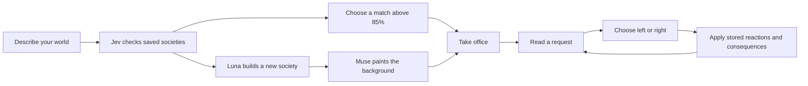

<div align="center">


# Swipe Republic

Running a nation would be easier if everyone agreed with you.

A political survival game set in whatever world you can describe.<br>
Inspired by the choices in <em>Reigns</em> and the character conflicts in <em>Lapse</em>.

[](https://swiperepublic.deadpackets.pw/)

[](wrangler.jsonc)
[](tsconfig.json)
[](package.json)
[](LICENSE)

[How to play](#how-to-play) · [How it works](#who-writes-the-trouble) · [Run locally](#run-locally) · [Deploy](#deploy-your-own-republic)

</div>

---

## First, invent somewhere to govern

Type a setting. It can be a historical place, a future colony, or a society whose citizens have no business forming a government.

> A republic of clockwork bees inside an abandoned observatory, 800 years after humans vanished.

The game builds a society around your description: four competing factions, 24 recurring characters, and eight ways for those factions to end your reign. Names, deaths, faction symbols and character silhouettes come from that world. The bees get bee problems.

Your introduction shows you the place and the people before you take office. Then the first visitor arrives with a request. There are two answers. Neither needs to be a good idea.

## How to play

Read one short request, check who reacts, and choose a side. There's no fixed turn limit or checklist of aims; survival is the job, and your dynasty outlives you. The AI spending allowance is separate: see [cost controls](#cost-controls).

| Control | What it does |
|---|---|
| Swipe the card | Drag left or right to answer. |
| Click or tap a choice | Answer with the same full card swipe. |
| Hold **←** or **→** | Commit after 700 ms. Release early to cancel. |
| Hover, focus or drag | See which factions react, and how strongly. Never which way. |

Keep every faction between empty and full. A faction at 0 has abandoned you. A faction at 100 owns you, and that ends a ruler just as surely.

When you fall, a death card records how, and you pick which faction backs your successor. Promises, laws and grudges carry on. Every faction can end a ruler two ways; collect all eight. Only **Menu → Abandon dynasty** ends the game, and your chronicle stays in Saved games.

<details>
<summary>Before you blame the controls</summary>

- A held arrow answers once. Release it before choosing again; Enter and Space don't submit a decision.
- Four factions start at 50 support. Reaching 0 or 100 ends the reign.
- A small dot is a small reaction, a large dot a large one. A flickering dot means Jev's judgment is uncertain, and that reaction has a smaller maximum effect.
- A successor's backer starts at 65, the rival candidate's faction at 40, the others at 50.
- Reduced motion and sound are in Menu. Motion follows your system preference; sound is off by default. Promises, people and your chronicle also live in Menu.

</details>

## Who writes the trouble?

The models have separate jobs. The game code applies the results.

| Model | Job | Integration |
|---|---|---|
| Luna · `~openai/gpt-luna-latest` | Writes the world, cast and dialogue; supplies faction symbols and silhouettes as vector path data. | AI SDK + OpenRouter provider |
| Jev · `~typesafe/jev-latest` | Scores both choices against each faction's priorities and checks similar societies. | TypeSafe SDK / System One through OpenRouter |
| Muse · `meta/muse-image` | Paints one background for a new society. | OpenRouter Images API |

Portraits and icons render locally as SVG. A new face doesn't need another image call. Faction colors help you recognize affiliations; they don't reveal hidden motives.

Luna is prompted to write short spoken requests, usually 8–28 words, with plain verbs and concrete stakes. The [Humanizer](https://github.com/blader/humanizer) writing rules inform the prompt. Characters should sound like people asking for something, even when those people happen to be storms.



Reusing a society is optional. You get its starting world and opening cards with a fresh private reign. Someone else's bad decisions remain their problem.

The first card is ready before you take office. Later cards are prepared in batches of three, and due promises interrupt the deck. Both choices are scored and saved before you answer, so refreshing won't reroll the outcome.

## Run locally

You'll need [Bun](https://bun.sh/) and an OpenRouter API key with access to the configured models.

```sh
git clone https://github.com/DeadPackets/SwipeRepublic.git
cd SwipeRepublic
bun install --frozen-lockfile
```

Create `.env` if you don't already have one:

```sh
cp -n .env.example .env
```

Set the key inside that file:

```dotenv
OPENROUTER_API_KEY=your-openrouter-key
```

Then prepare the local database and start the app:

```sh
bunx wrangler d1 migrations apply swipe-republic-campaigns --local
bun run dev
```

Open the localhost URL printed by Vite. The Cloudflare plugin runs the Worker, Durable Objects and storage locally. Model requests still use your OpenRouter account. Keep the key server-side; `.env` is ignored by Git, and it must never use a `VITE_` prefix.

## Deploy your own republic

The app is designed around a $5/month Workers hosting budget. OpenRouter model usage costs extra.

| Cloudflare service | What lives there |
|---|---|
| Worker + Static Assets | React frontend and game API |
| Durable Objects | Private saves, generation jobs and spending reservations |
| D1 | Reusable societies and their search index |
| R2 | Generated backgrounds |

Generation runs through Durable Object alarms so a world can finish after the initial request returns. The frontend uses React, TypeScript and Vite, with locally bundled Newsreader and Manrope fonts.

<details>
<summary>Cloudflare setup and deployment commands</summary>

Sign in and create the storage resources in your account:

```sh
bunx wrangler login
bunx wrangler d1 create swipe-republic-campaigns
bunx wrangler r2 bucket create swipe-republic-art
```

Update [wrangler.jsonc](wrangler.jsonc) with your D1 database ID and your own domain, or remove `routes` to use the Worker's `workers.dev` address. The checked-in IDs and custom domain belong to the existing deployment.

Set the production secret, apply the database schema, and deploy:

```sh
bunx wrangler secret put OPENROUTER_API_KEY
bunx wrangler d1 migrations apply swipe-republic-campaigns --remote
bun run deploy
```

`bun run deploy` builds before uploading. Later releases only need that command unless the database schema or secrets change. Keep the Durable Object migration history in the config; it includes the [confirmed production reset](docs/plans/2026-09-22-production-reset.md).

</details>

### Cost controls

There is no daily count limit on new societies. Spending limits still apply:

| Limit | Default |
|---|---:|
| Shared AI allowance per UTC day | $1.00 |
| AI allowance per private society save | $0.20 |
| Paid preparations per save | 100 |
| API requests per IP | 120 per minute |

The dollar limits live in [wrangler.jsonc](wrangler.jsonc). Calls reserve budget before they start and settle against reported usage. A failed or interrupted call can retain its reservation; reaching an allowance pauses generation and preserves the save. An OpenRouter key credit limit provides a separate account-level cap.

A measured background generation cost $0.01. That is a test result, not a price guarantee. [Release notes](docs/release-verification-2026-09-22.md) include generation timings and live checks. The on-screen 30-second countdown is an estimate; a new world can take longer.

<details>
<summary>Shared worlds, private saves, and the catch with guest cookies</summary>

Jev scores candidate societies on a 0–100 similarity rubric. Only scores strictly above 85 are offered. Small catalogs are checked in full; larger ones use full-text candidates plus recent entries, so a distant paraphrase can be missed. You can always request an original world.

Finished world descriptions, casts, artwork and opening cards enter the shared catalog. The original prompt field, private decisions and session credentials do not. Generated world descriptions can still reflect details in your prompt.

Your private save belongs to an HttpOnly guest cookie in that browser. The cookie lasts 30 days; clearing or losing it loses access. There are no accounts or cross-device recovery. Download the chronicle from Menu if you want to keep the story. Saved-game links use local storage, and tab coordination needs a current browser on HTTPS or localhost.

Historical settings are fictional alternate histories. A persuasive adviser is not a reliable history textbook.

</details>

## Working on the game

```sh
bun test src worker
bun run build
```

Tests cover held-key controls, deaths at both limits, succession, hidden previews, abandonment, promise callbacks, save isolation and generation budgets. The build also checks TypeScript.

For a full campaign test with real model calls, pass your running server's URL:

```sh
bun scripts/campaign-smoke.ts http://127.0.0.1:5173
```

This spends OpenRouter credit and creates test saves. It checks generation, artwork, matching, private ownership, independent reuse and repeated decisions. Its session data stays under the Git-ignored `artifacts/` directory.

| Start here | For |
|---|---|
| [src/game.ts](src/game.ts) | Game rules, state and schemas |
| [src/play/DecisionCard.tsx](src/play/DecisionCard.tsx) | Card gestures, throw and deal animation |
| [src/motion.ts](src/motion.ts) | Every motion constant |
| [worker/ai.ts](worker/ai.ts) | Luna prompts and Jev scoring |
| [worker/index.ts](worker/index.ts) | API, saves and generation jobs |
| [DESIGN.md](DESIGN.md) | Visual direction and interaction choices |

---

Licensed under [MIT](LICENSE). Inspired by *Reigns* and *Lapse*; an independent project.

[Take office →](https://swiperepublic.deadpackets.pw/)
